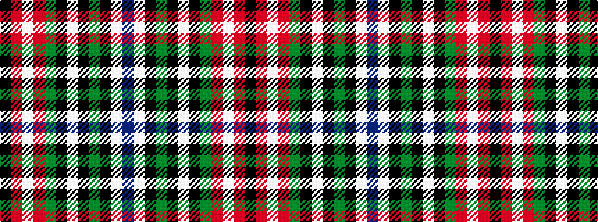

BWKGKWKGRWRK

It is a 12 stripe tartan.

<figure class="pat-woven">

<figcaption>idealised sample</figcaption>
</figure>

## Colour Sequence



## Tartans with this colour sequence

This pattern is a design lineage: every tartan below shares one colour order, whatever its owner —
near-identical designs are grouped, the largest lineage first (#112: the pattern is a tartan's
second parent, beside its family or clan).

<table class="sett-table">
<tbody>
<tr><td><a href="/variants/s12/do9lb5k8y2k4w4k4g28r44lb4r5k3~x2/">MacLean (rare)</a></td></tr>
<tr><td class="sett-swatch"></td></tr>
<tr><td><a href="/variants/s12/n9lb5k8y2k4w4k4g31r50lb4r4k3~x2/">MacLean of Duart</a></td></tr>
<tr><td class="sett-swatch"></td></tr>
<tr class="cluster-sep"><td></td></tr>
<tr><td><a href="/setts/db4lb1k3y1k1w1k1g8r12lb1r2k1/">MacLean of Duart #6</a></td></tr>
<tr><td class="sett-swatch"></td></tr>
</tbody>
</table>

