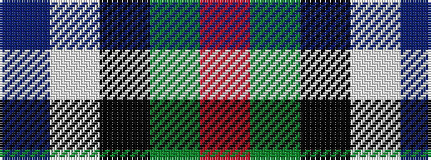

BWKGR

It is a 5 stripe tartan.

<figure class="pat-woven">

<figcaption>idealised sample</figcaption>
</figure>

## Colour Sequence



## Tartans with this colour sequence

| Tartans |
|---------------|
| [Fily, Sylvain Roger](/setts/s5/r2g2k20w1db1~x6/)|
||
