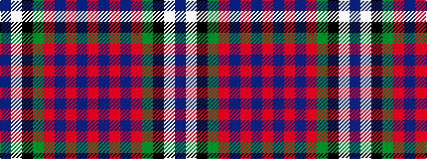

BWKGRBRBR

It is a 9 stripe tartan.

<figure class="pat-woven">

<figcaption>idealised sample</figcaption>
</figure>

## Colour Sequence



## Tartans with this colour sequence

| Tartans |
|---------------|
| [Burt #2 (Name)](/variants/s9/db8w2k8g12r2db3r2db24r2~x2/)|
||
