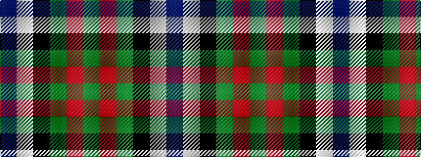

BWKGRG

It is a 6 stripe tartan.

<figure class="pat-woven">

<figcaption>idealised sample</figcaption>
</figure>

## Colour Sequence



## Tartans with this colour sequence

| Tartans |
|---------------|
| [MacFadzean](/variants/s6/db48w2k20dg22r3dg4~x2/)|
||
| [MacFadzean](/variants/s6/db48w2k20g22r3g4~x2/)|
||
| [Paterson Blue (Personal)](/variants/s6/db22w2k10g11r3g4~x2/)|
||
