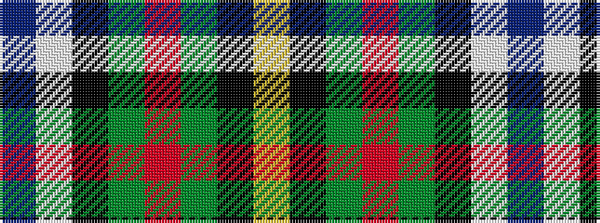

BWKGRGKY

It is a 8 stripe tartan.

<figure class="pat-woven">

<figcaption>idealised sample</figcaption>
</figure>

## Colour Sequence



## Tartans with this colour sequence

| Tartans |
|---------------|
| [MacLaren Dress](/setts/s8/db2w12k8g8r2g8k1lo2~x2/)|
||
| [MacLaren dress](/setts/s8/db7w30k13g9r6g16k2ly7~x2/)|
||
