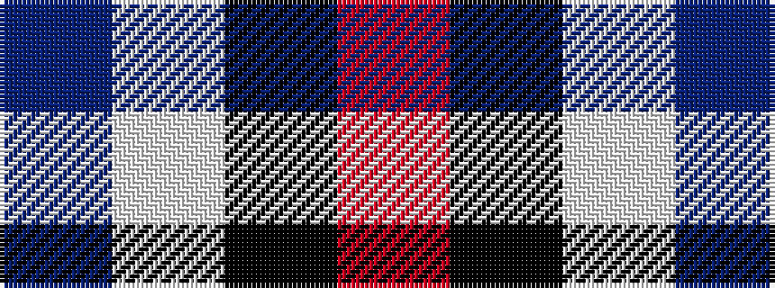

BWKR

It is a 4 stripe tartan.

<figure class="pat-woven">

<figcaption>idealised sample</figcaption>
</figure>

## Colour Sequence



## Tartans with this colour sequence

| Tartans |
|---------------|
| [Gleneckley](/variants/s4/db3w25k25r3~x2/)|
||
| [Hamby Sport (Personal)](/variants/s4/r25k13w8db5~x2/)|
||
