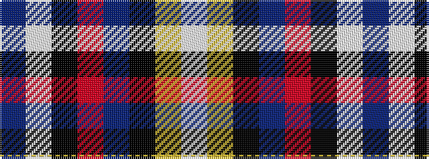

BWKRBKYW

It is a 8 stripe tartan.

<figure class="pat-woven">

<figcaption>idealised sample</figcaption>
</figure>

## Colour Sequence



## Tartans with this colour sequence

| Tartans |
|---------------|
| [Singer Sewing Machine Company](/setts/s8/db3w2k2r62db2k2ly2w2~x2/)|
||
