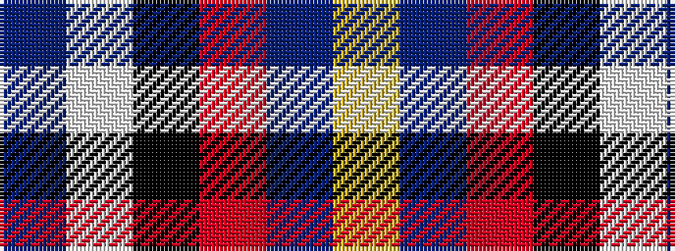

BWKRBY

It is a 6 stripe tartan.

<figure class="pat-woven">

<figcaption>idealised sample</figcaption>
</figure>

## Colour Sequence



## Tartans with this colour sequence

| Tartans |
|---------------|
| [Kirkcaldy](/variants/s6/t23w3k10r2db45ly1~x2/)|
||
| [Kirkcaldy Name Tartan](/variants/s6/t23w3k10r2dt45ly1~x2/)|
||
