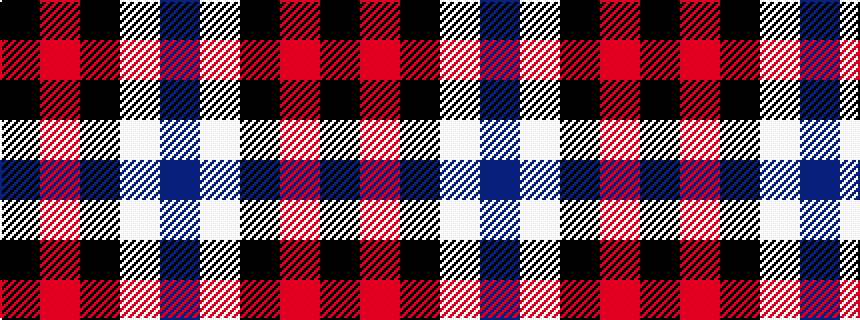

BWKRK

It is a 5 stripe tartan.

<figure class="pat-woven">

<figcaption>idealised sample</figcaption>
</figure>

## Colour Sequence



## Tartans with this colour sequence

| Tartans |
|---------------|
| [Brodie Dress](/variants/s5/k6r33k18w20db6~x2/)|
||
| [Wallace Dress, Red (Dance)](/variants/s5/k3r28k10w28t3~x2/)|
||
