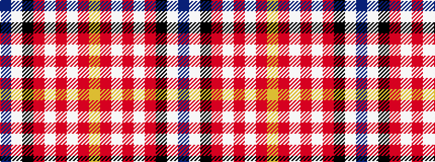

BWKRWRWRY

It is a 9 stripe tartan.

<figure class="pat-woven">

<figcaption>idealised sample</figcaption>
</figure>

## Colour Sequence



## Tartans with this colour sequence

| Tartans |
|---------------|
| [Hearts Football Club (Corporate)](/variants/s9/db3w12k11r4w2r2w2r24ly3~x2/)|
||
