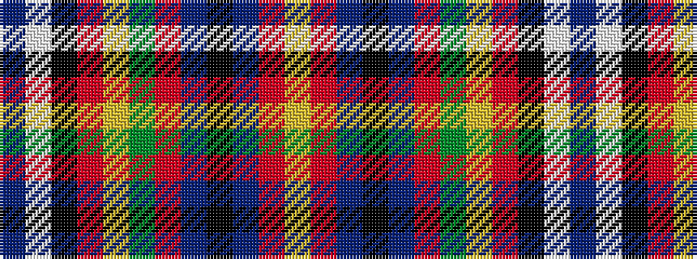

BWKRYGRBKBRY

It is a 12 stripe tartan.

<figure class="pat-woven">

<figcaption>idealised sample</figcaption>
</figure>

## Colour Sequence



## Tartans with this colour sequence

| Tartans |
|---------------|
| [Wren (Name)](/setts/s12/db6w2k2r6ly2g12r6t3k3t3r28ly4~x2/)|
||
