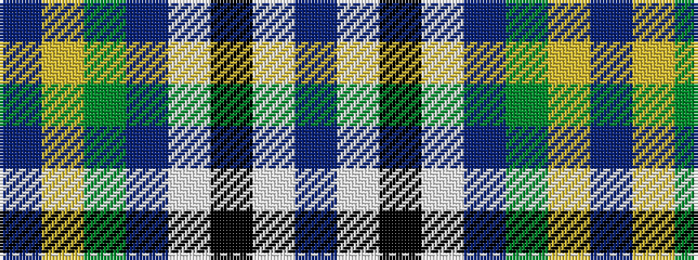

BWKWBGYB

It is a 8 stripe tartan.

<figure class="pat-woven">

<figcaption>idealised sample</figcaption>
</figure>

## Colour Sequence



## Tartans with this colour sequence

| Tartans |
|---------------|
| [Boat of Garten](/variants/s8/db62w4k2w7dp2dg3ly2db16~x2/)|
||
