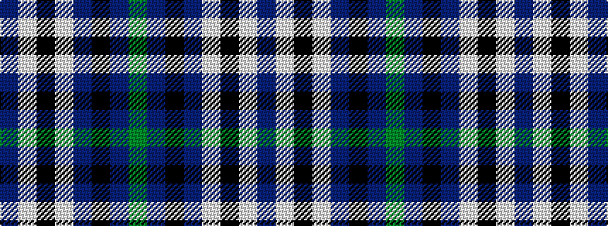

BWKWBKBG

It is a 8 stripe tartan.

<figure class="pat-woven">

<figcaption>idealised sample</figcaption>
</figure>

## Colour Sequence



## Tartans with this colour sequence

| Tartans |
|---------------|
| [Culloden - 1977 (Fashion)](/variants/s8/db2lb4k2lb1db4k1db1g1~x4/)|
||
