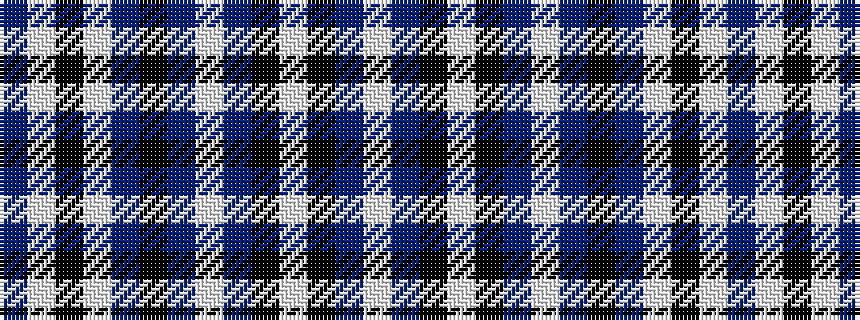

BWKWBKBWBKWKBW

It is a 14 stripe tartan.

<figure class="pat-woven">

<figcaption>idealised sample</figcaption>
</figure>

## Colour Sequence



## Tartans with this colour sequence

| Tartans |
|---------------|
| [Skye Dress Blue, Isle of (Dance)](/variants/s14/n7w7k3w30n20k5t1w8t1k4w4k7t1w6~x2/)|
||
