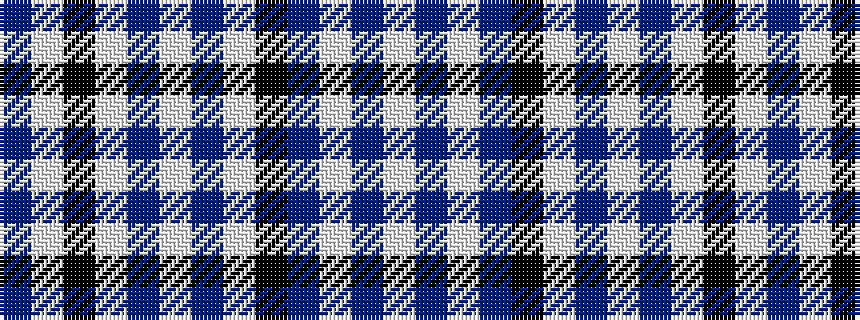

BWKWBWBWKBWBW

It is a 13 stripe tartan.

<figure class="pat-woven">

<figcaption>idealised sample</figcaption>
</figure>

## Colour Sequence



## Tartans with this colour sequence

| Tartans |
|---------------|
| [Balmoral (Jack Allen)](/setts/s13/lb4t2lb25n16k4lb2n2lb2n10lb4k2lb2t2~x2/)|
||
