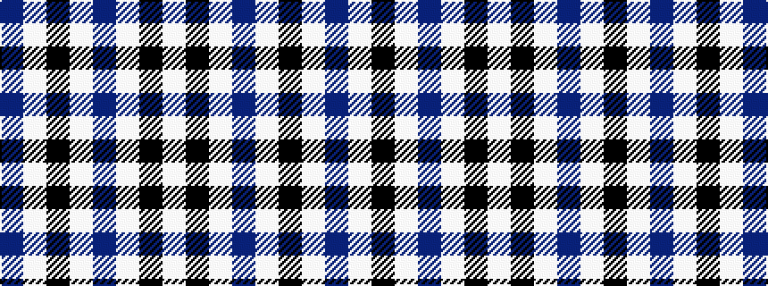

BWKWBWKW

It is a 8 stripe tartan.

<figure class="pat-woven">

<figcaption>idealised sample</figcaption>
</figure>

## Colour Sequence



## Tartans with this colour sequence

| Tartans |
|---------------|
| [Detroit Lions](/variants/s8/db30lb2k9w3db6w4k3lb6~x2/)|
||
