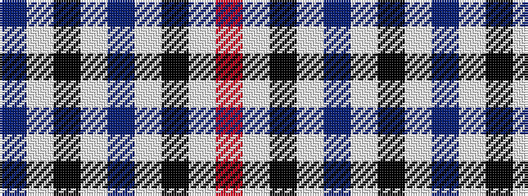

BWKWBWKWR

It is a 9 stripe tartan.

<figure class="pat-woven">

<figcaption>idealised sample</figcaption>
</figure>

## Colour Sequence



## Tartans with this colour sequence

| Tartans |
|---------------|
| [Dupplin Check](/variants/s9/do1lb1k1lb1do1lb1k1lb1r1~x6/)|
||
