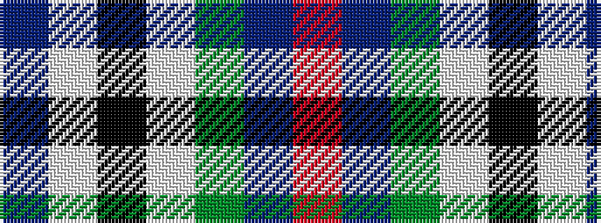

BWKWGBR

It is a 7 stripe tartan.

<figure class="pat-woven">

<figcaption>idealised sample</figcaption>
</figure>

## Colour Sequence



## Tartans with this colour sequence

| Tartans |
|---------------|
| [Puxty-Dunne](/variants/s7/dt18w2k1w4dg13dt40r2~x2/)|
||
| [Puxty-Dunne (Personal)](/variants/s7/n18w2k1w4g13n40r2~x2/)|
||
