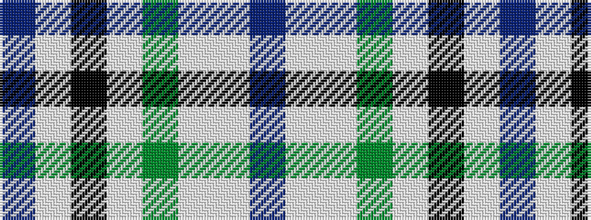

BWKWGWWB

It is a 8 stripe tartan.

<figure class="pat-woven">

<figcaption>idealised sample</figcaption>
</figure>

## Colour Sequence



## Tartans with this colour sequence

| Tartans |
|---------------|
| [Desang](/setts/s8/dr4w2lb8dg2lb8k3w2db4~x2/)|
||
