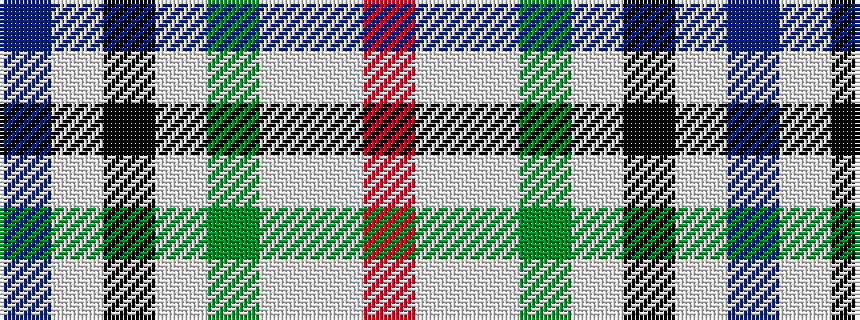

BWKWGWWR

It is a 8 stripe tartan.

<figure class="pat-woven">

<figcaption>idealised sample</figcaption>
</figure>

## Colour Sequence



## Tartans with this colour sequence

| Tartans |
|---------------|
| [Desang (Corporate)](/variants/s8/db4w2k3lb8g2lb8w2r4~x4/)|
||
