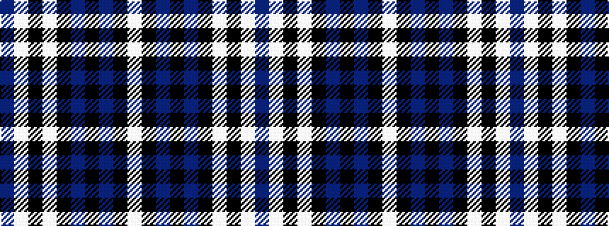

BWKWKBKBKW

It is a 10 stripe tartan.

<figure class="pat-woven">

<figcaption>idealised sample</figcaption>
</figure>

## Colour Sequence



## Tartans with this colour sequence

| Tartans |
|---------------|
| [Seacliff Academy](/variants/s10/dt46w1k3lt4k3b3k2b11k1lt2~x2/)|
||
