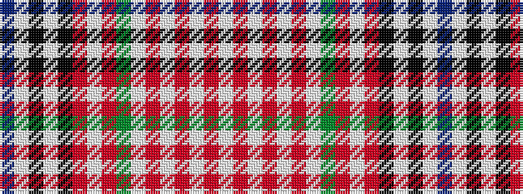

BWKWKRWRGWRWRWRW

It is a 16 stripe tartan.

<figure class="pat-woven">

<figcaption>idealised sample</figcaption>
</figure>

## Colour Sequence



## Tartans with this colour sequence

| Tartans |
|---------------|
| [Manhattan Financial](/setts/s16/w24r1w3o9w10o4w3g1o3w3o2k10w4k7w12db2~x2/)|
||
