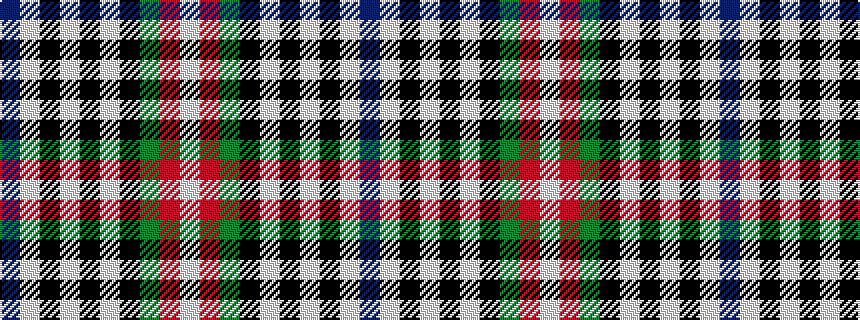

BWKWKWKGRW

It is a 10 stripe tartan.

<figure class="pat-woven">

<figcaption>idealised sample</figcaption>
</figure>

## Colour Sequence



## Tartans with this colour sequence

| Tartans |
|---------------|
| [Racing Stewart](/variants/s10/db54lb3k5lb1k2lb1k2g8r8lb2~x2/)|
||
| [Racing Stewart](/variants/s10/db108w6k10w3k3w3k3g12r12w4/)|
||
