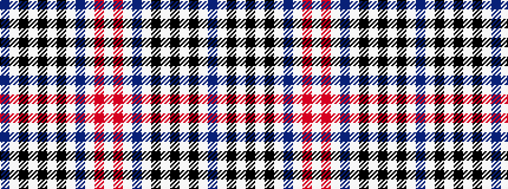

BWKWKWKWBWRW

It is a 12 stripe tartan.

<figure class="pat-woven">

<figcaption>idealised sample</figcaption>
</figure>

## Colour Sequence



## Tartans with this colour sequence

| Tartans |
|---------------|
| [Humanitarian Mission (Dress)](/variants/s12/n3w24k3w1k2w2k1w3n7w2r24w3~x2/)|
||
