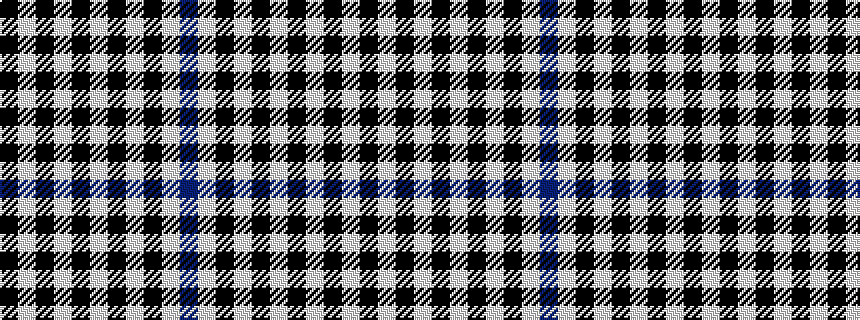

BWKWKWKWKWK

It is a 11 stripe tartan.

<figure class="pat-woven">

<figcaption>idealised sample</figcaption>
</figure>

## Colour Sequence



## Tartans with this colour sequence

| Tartans |
|---------------|
| [Buccleuch Check (9 squares)](/variants/s11/b5w4k4w4k4w4k4w4k4w4k4~x2/)|
||
