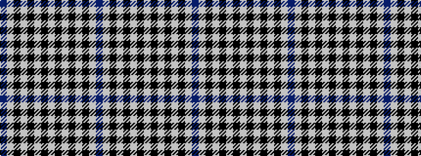

BWKWKWKWKWKWKWB

It is a 15 stripe tartan.

<figure class="pat-woven">

<figcaption>idealised sample</figcaption>
</figure>

## Colour Sequence



## Tartans with this colour sequence

| Tartans |
|---------------|
| [Haig Check](/variants/s15/b1w1k1w1k1w1k1w1k1w1k1w1k1w1b1~x12/)|
||
