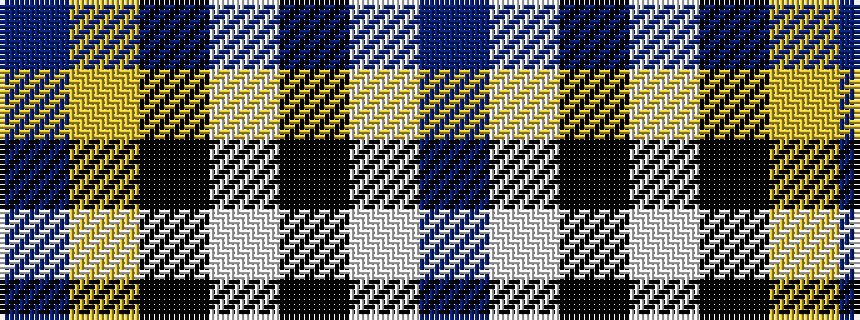

BWKWKYB

It is a 7 stripe tartan.

<figure class="pat-woven">

<figcaption>idealised sample</figcaption>
</figure>

## Colour Sequence



## Tartans with this colour sequence

| Tartans |
|---------------|
| [Orange Fanaticos (Corporate)](/setts/s7/t12lo75k22w12k22w16t8/)|
||
