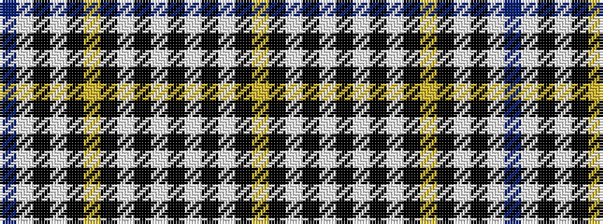

BWKWKYKWKWKWKWKY

It is a 16 stripe tartan.

<figure class="pat-woven">

<figcaption>idealised sample</figcaption>
</figure>

## Colour Sequence



## Tartans with this colour sequence

| Tartans |
|---------------|
| [Livingston, dress](/variants/s16/db133w16k8w8k2ly4k2w54k8w8k16w8k16w16k2ly12/)|
||
| [Livingstone Dress](/variants/s16/db54w3k3w3k2ly3k2w20k3w3k4w3k4w4k2ly4~x2/)|
||
