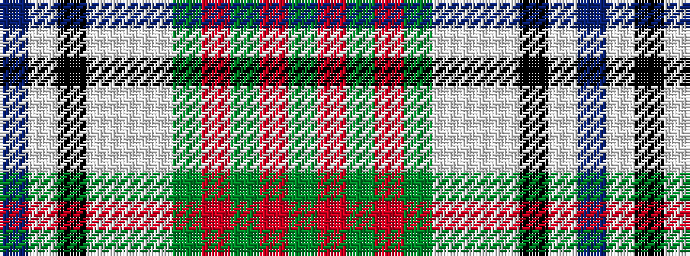

BWKWWWGRGRG

It is a 11 stripe tartan.

<figure class="pat-woven">

<figcaption>idealised sample</figcaption>
</figure>

## Colour Sequence



## Tartans with this colour sequence

| Tartans |
|---------------|
| [DunBroch (Corporate)](/setts/s11/db4lb8k2lb5lbi2lb5dg8r7dg2r7dg3~x2/)|
||
