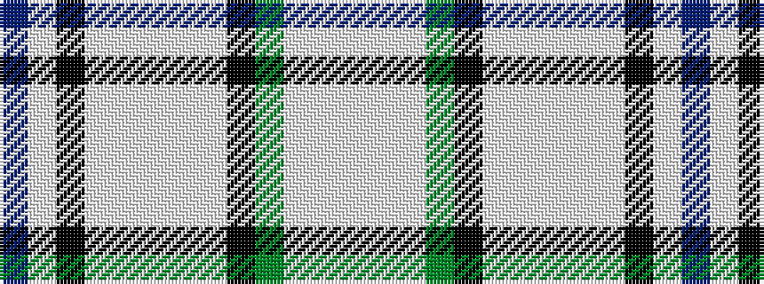

BWKWWWWWKGWWW

It is a 13 stripe tartan.

<figure class="pat-woven">

<figcaption>idealised sample</figcaption>
</figure>

## Colour Sequence



## Tartans with this colour sequence

| Tartans |
|---------------|
| [Diana Memorial Rose](/setts/s13/lb4w2lb23y12k6w2lt2w2lt8w4k2w2dr2~x2/)|
||
