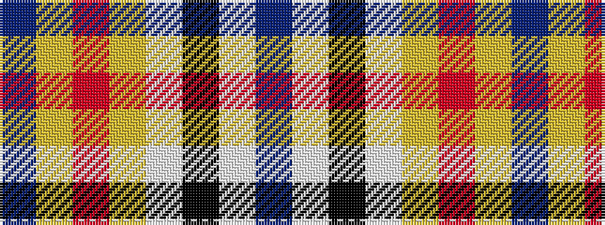

BWKWYRYB

It is a 8 stripe tartan.

<figure class="pat-woven">

<figcaption>idealised sample</figcaption>
</figure>

## Colour Sequence



## Tartans with this colour sequence

| Tartans |
|---------------|
| [Wingtip](/setts/s8/db11lb1k3w1lg4r5lo1db5~x4/)|
||
