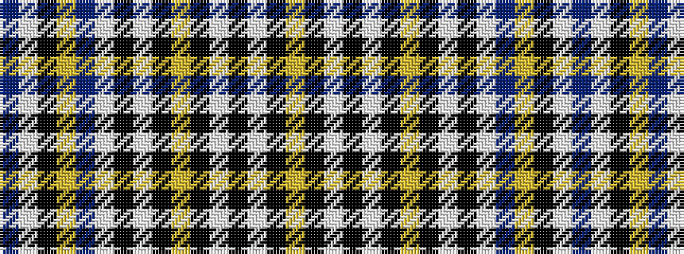

BWKYBWKWKYKWKWKY

It is a 16 stripe tartan.

<figure class="pat-woven">

<figcaption>idealised sample</figcaption>
</figure>

## Colour Sequence



## Tartans with this colour sequence

| Tartans |
|---------------|
| [Deudon (2015)](/variants/s16/ly5k5w15k32w1k2ly1k32w15k5w5t4ly2k1w2t4~x2/)|
||
