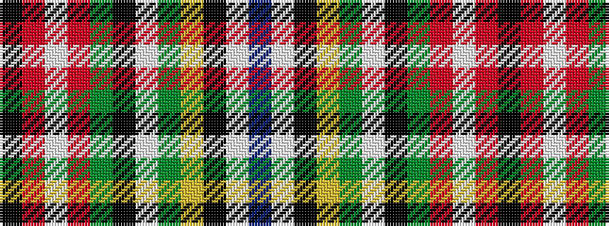

BWKYGWKGRWRK

It is a 12 stripe tartan.

<figure class="pat-woven">

<figcaption>idealised sample</figcaption>
</figure>

## Colour Sequence



## Tartans with this colour sequence

| Tartans |
|---------------|
| [MacLean](/setts/s12/db4lb1k3ly1dg1lb1k1dg8r12lb1r2k1~x2/)|
||
