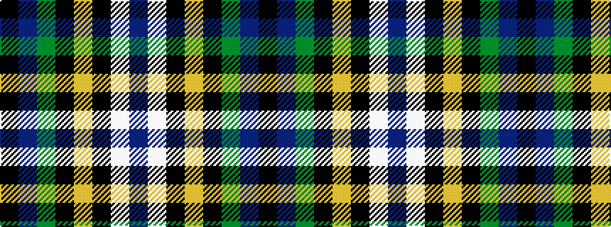

BWKYKGBK

It is a 8 stripe tartan.

<figure class="pat-woven">

<figcaption>idealised sample</figcaption>
</figure>

## Colour Sequence



## Tartans with this colour sequence

| Tartans |
|---------------|
| [Glasgow, University of](/variants/s8/k2db22g4k7lo2k2w2db2~x2/)|
||
