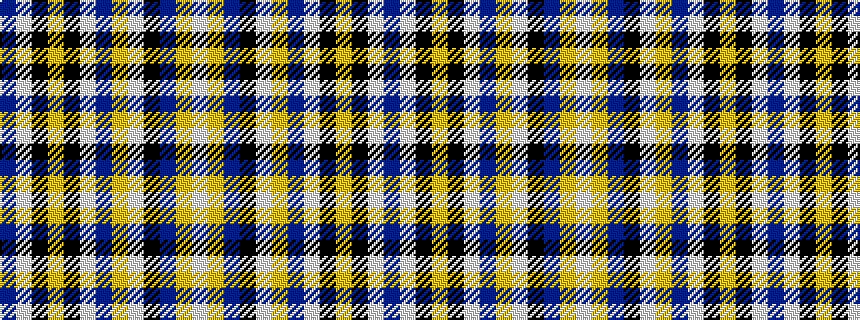

BWKYKWBYWKBYW

It is a 13 stripe tartan.

<figure class="pat-woven">

<figcaption>idealised sample</figcaption>
</figure>

## Colour Sequence



## Tartans with this colour sequence

| Tartans |
|---------------|
| [Dinarzh: (Fashion)](/variants/s13/w4ly10db20k1w12ly1db4w2k4ly5k10w5db2~x2/)|
||
| [Dinarzh: Fortress of the Bear](/variants/s13/w4ly10b20k1w12ly1b4w2k4ly5k10w5b2~x2/)|
||
