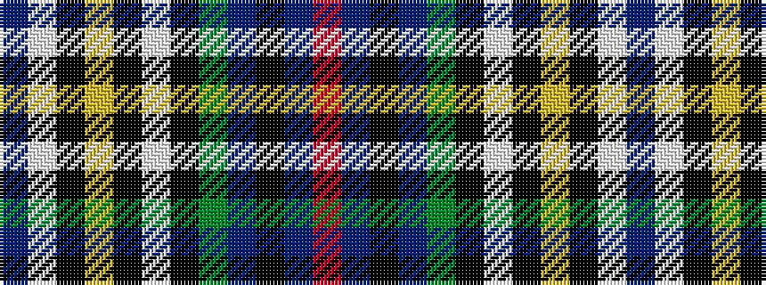

BWKYKWKGBKBR

It is a 12 stripe tartan.

<figure class="pat-woven">

<figcaption>idealised sample</figcaption>
</figure>

## Colour Sequence



## Tartans with this colour sequence

| Tartans |
|---------------|
| [O'Shaughnessy Memorial](/setts/s12/n57lb3k9ly2k2w3k2g10n6k2n2r3~x2/)|
||
