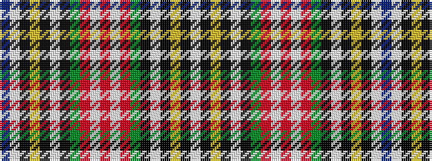

BWKYKWKGRWRWRGKWKYKW

It is a 20 stripe tartan.

<figure class="pat-woven">

<figcaption>idealised sample</figcaption>
</figure>

## Colour Sequence



## Tartans with this colour sequence

| Tartans |
|---------------|
| [Unidentified Scarlett #16](/setts/s20/db9lb1k8ly1k2w2k2g13r45w1r4~x2/)|
||
