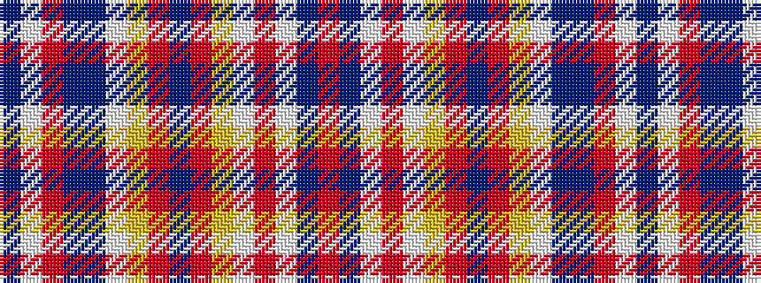

BWRBBWYRBRYWRWBR

It is a 16 stripe tartan.

<figure class="pat-woven">

<figcaption>idealised sample</figcaption>
</figure>

## Colour Sequence



## Tartans with this colour sequence

| Tartans |
|---------------|
| [MacGlashan](/variants/s16/r25dr3w2o25w3ly5r4dr2r4ly5w3db4dr5r6w1db1~x2/)|
||
