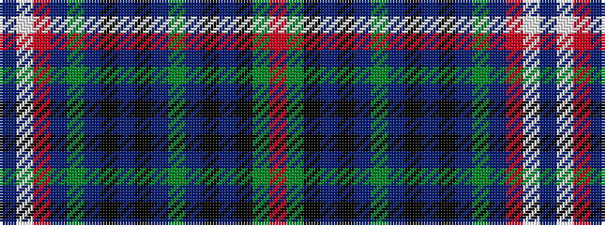

BWRBGBKBKBGBKBKGR

It is a 17 stripe tartan.

<figure class="pat-woven">

<figcaption>idealised sample</figcaption>
</figure>

## Colour Sequence



## Tartans with this colour sequence

| Tartans |
|---------------|
| [Lee Cox (Personal)](/setts/s17/n3w2r2dp6dg10n3k3n3k3n3dg14n3k3n3k7dg2r3~x2/)|
||
| [Lee Cox (Personal)](/setts/s17/r3g2k7t3k3t3g14t3k3t3k3t3g10dp6r2w2t3~x2/)|
||
