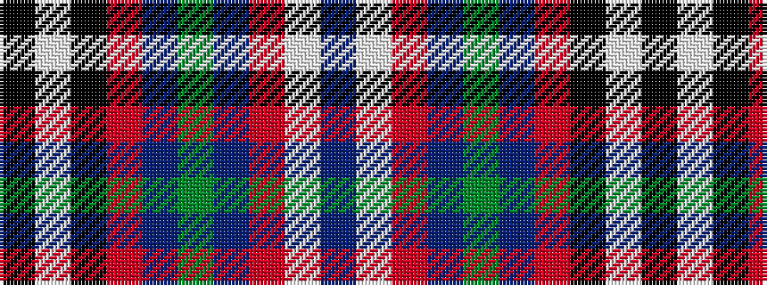

BWRBGBRKWK

It is a 10 stripe tartan.

<figure class="pat-woven">

<figcaption>idealised sample</figcaption>
</figure>

## Colour Sequence



## Tartans with this colour sequence

| Tartans |
|---------------|
| [Bro-Zol](/setts/s10/k3w9k2r8db1g3db1r25w5db3~x2/)|
||
