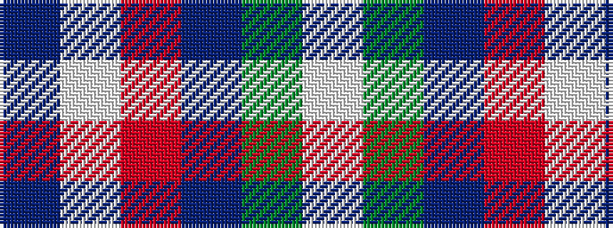

BWRBGW

It is a 6 stripe tartan.

<figure class="pat-woven">

<figcaption>idealised sample</figcaption>
</figure>

## Colour Sequence



## Tartans with this colour sequence

| Tartans |
|---------------|
| [McEachem (Name)](/setts/s6/n7w1r6dt10g10w1~x4/)|
||
| [McEachern, Andrew](/setts/s6/do7w1r6db10g10w1~x4/)|
||
