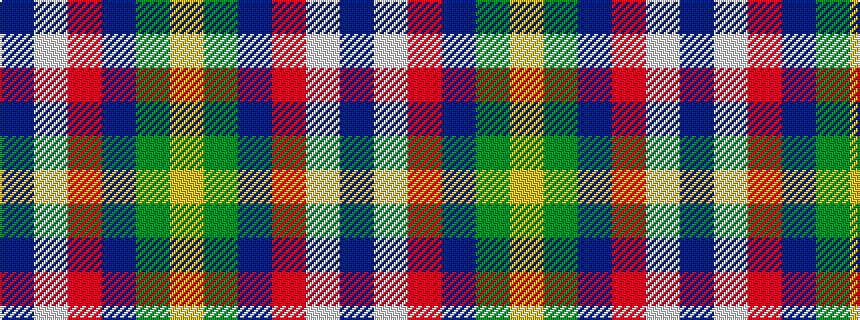

BWRBGY

It is a 6 stripe tartan.

<figure class="pat-woven">

<figcaption>idealised sample</figcaption>
</figure>

## Colour Sequence



## Tartans with this colour sequence

| Tartans |
|---------------|
| [COG USA, THE](/variants/s6/lo9dg18t9r1w1db1~x4/)|
||
| [T.H.E. C.O.G. USA (Corporate)](/variants/s6/lo9g18t9r1w1db1~x4/)|
||
