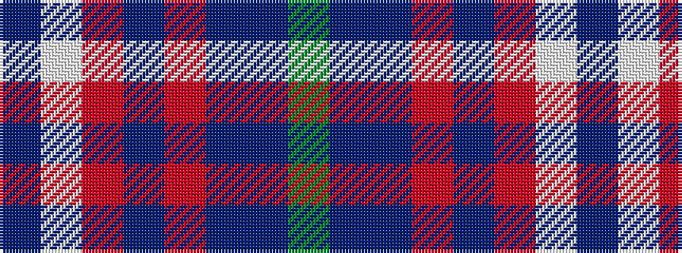

BWRBRBBG

It is a 8 stripe tartan.

<figure class="pat-woven">

<figcaption>idealised sample</figcaption>
</figure>

## Colour Sequence



## Tartans with this colour sequence

| Tartans |
|---------------|
| [Harding (Name)](/setts/s8/dg30dt2n7r14n7r7w1dt14~x2/)|
||
