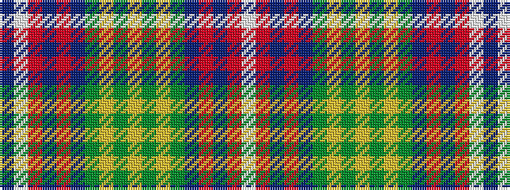

BWRBRBGYGYGYGBRBRW

It is a 18 stripe tartan.

<figure class="pat-woven">

<figcaption>idealised sample</figcaption>
</figure>

## Colour Sequence



## Tartans with this colour sequence

| Tartans |
|---------------|
| [Hobkirk](/setts/s18/b5w1m9b5r4b5g20ly1g1ly1~x4/)|
||
