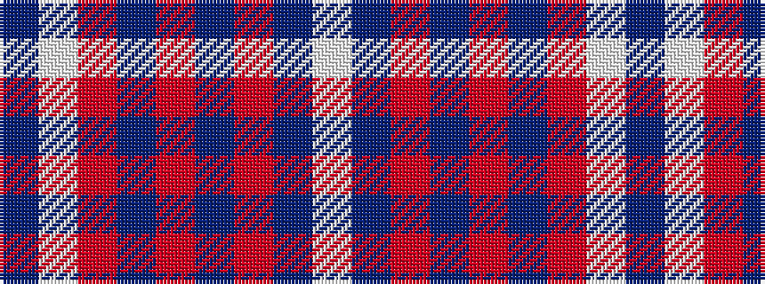

BWRBRBRBW

It is a 9 stripe tartan.

<figure class="pat-woven">

<figcaption>idealised sample</figcaption>
</figure>

## Colour Sequence



## Tartans with this colour sequence

| Tartans |
|---------------|
| [Canna, Saphire (Dance)](/setts/s9/b4w30r4b3r1b1r1b22w2~x2/)|
||
