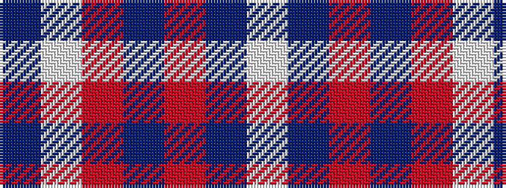

BWRBRBW

It is a 7 stripe tartan.

<figure class="pat-woven">

<figcaption>idealised sample</figcaption>
</figure>

## Colour Sequence



## Tartans with this colour sequence

| Tartans |
|---------------|
| [Coronation](/setts/s7/db7w1r7db4r2db4w2~x2/)|
||
| [Coronation](/setts/s7/db11w1r12db6r1db6w1~x2/)|
||
| [Coronation (1936) #2](/setts/s7/db11w1r12db6r1db6w1~x4/)|
||
