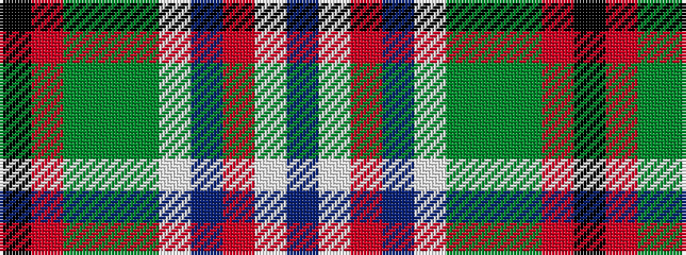

BWRBWGGGRK

It is a 10 stripe tartan.

<figure class="pat-woven">

<figcaption>idealised sample</figcaption>
</figure>

## Colour Sequence



## Tartans with this colour sequence

| Tartans |
|---------------|
| [Gettelman (2016)](/variants/s10/k60o4gi25g3gi4w1db1r1w1db3~x2/)|
||
