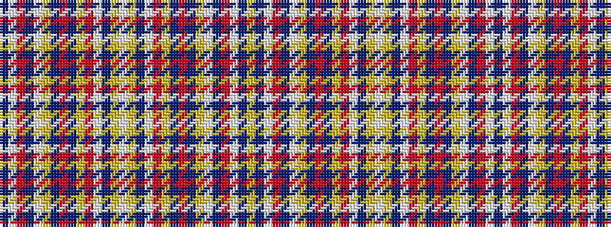

BWRBWYBRBYRWBYWYBWRYBRBYWBRWBY

It is a 30 stripe tartan.

<figure class="pat-woven">

<figcaption>idealised sample</figcaption>
</figure>

## Colour Sequence



## Tartans with this colour sequence

| Tartans |
|---------------|
| [Setting Sun, The](/variants/s30/lo15do4lb8o18do2lb2lo4do2o6do16lo2o2lb6do2lo3lb1~x2/)|
||
