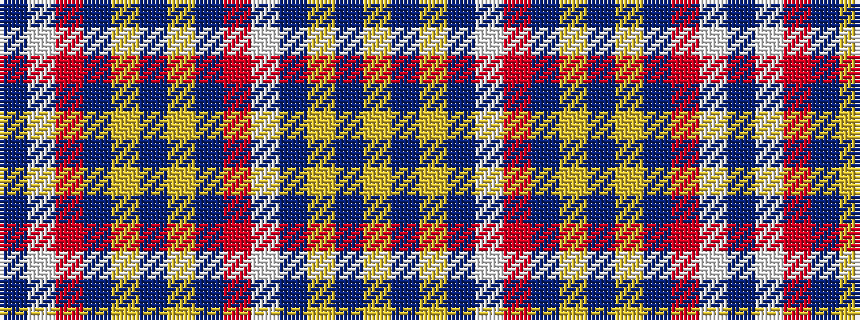

BWRBYBYBRWBYBY

It is a 14 stripe tartan.

<figure class="pat-woven">

<figcaption>idealised sample</figcaption>
</figure>

## Colour Sequence



## Tartans with this colour sequence

| Tartans |
|---------------|
| [Denver Broncos (Sports)](/variants/s14/db10w3m4db6ly2db2ly2db6m4w3db10lo5db2lo10~x2/)|
||
