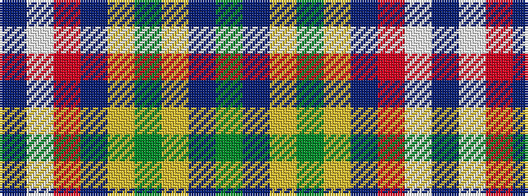

BWRBYGYBG

It is a 9 stripe tartan.

<figure class="pat-woven">

<figcaption>idealised sample</figcaption>
</figure>

## Colour Sequence



## Tartans with this colour sequence

| Tartans |
|---------------|
| [Ogilvie of Inverquharity or Ohio](/setts/s9/db16w6r8db3lo1g1lg3db1g10~x4/)|
||
